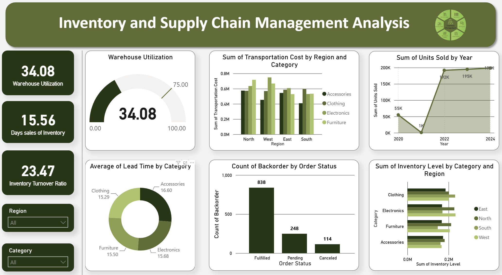

# 📦 Inventory and Supply Chain Management Analysis Dashboard

An interactive **Power BI** dashboard that provides end-to-end visibility into inventory health, warehouse efficiency, transportation costs, and order fulfillment performance across regions and product categories.




---

## 📊 Overview

This dashboard was built to help supply chain and operations teams monitor key inventory and logistics metrics at a glance, drill down by **Region** and **Category**, and quickly spot bottlenecks such as high backorders or transportation cost spikes.

## ✨ Key Features

- **Interactive Slicers** — Filter the entire dashboard by `Region` and `Category`
- **KPI Cards** — Quick-glance summary metrics for high-level performance
- **Gauge Visual** — Warehouse utilization against a target benchmark
- **Trend Analysis** — Units sold over time (2020–2024)
- **Comparative Bar Charts** — Transportation cost and inventory levels sliced by region and category
- **Donut Chart** — Average lead time distribution by category
- **Order Status Breakdown** — Backorder counts across Fulfilled, Pending, and Canceled orders

## 📈 KPIs & Metrics

| Metric | Description |
|---|---|
| **Warehouse Utilization** | 34.08% — current capacity usage against a 100% scale (target line at 75) |
| **Days Sales of Inventory (DSI)** | 15.56 — average number of days inventory is held before sale |
| **Inventory Turnover Ratio** | 23.47 — how efficiently inventory is sold and replaced |
| **Sum of Units Sold by Year** | Trend from 2020 to 2024 |
| **Average Lead Time by Category** | Accessories, Clothing, Electronics, Furniture |
| **Backorder Count by Order Status** | Fulfilled, Pending, Canceled |

## 🧩 Visuals Included

1. **Warehouse Utilization** — Gauge chart
2. **Sum of Transportation Cost by Region and Category** — Clustered bar chart
3. **Sum of Units Sold by Year** — Area/line chart
4. **Average Lead Time by Category** — Donut chart
5. **Count of Backorder by Order Status** — Column chart
6. **Sum of Inventory Level by Category and Region** — Horizontal bar chart

## 🛠️ Tech Stack

- **Tool:** Microsoft Power BI Desktop
- **Data Source:** Excel / CSV (Inventory & Supply Chain dataset)
- **Techniques Used:** DAX measures, slicers, gauge visuals, conditional formatting, custom theming

## 📁 Repository Structure

```
inventory-supply-chain-dashboard/
├── assets/
│   └── dashboard-preview.png     # Dashboard screenshot
├── data/
│   └── inventory_data.csv        # Source dataset (or sample)
├── Inventory_Supply_Chain.pbix   # Power BI dashboard file
└── README.md                     # Project documentation
```

## 🚀 How to Use

1. Clone this repository:
   ```bash
   git clone https://github.com/aryankharvar/Inventory_Supply_Chain_Analysis.git
   ```
2. Open `Inventory_Supply_Chain.pbix` in **Power BI Desktop** (free download [here](https://www.microsoft.com/en-us/power-platform/products/power-bi/downloads)).
3. If prompted, update the data source path to point to your local `data/inventory_data.csv`.
4. Use the **Region** and **Category** slicers on the left panel to explore the data interactively.

## 🔍 Key Insights

- Units sold saw a sharp dip in 2021 before recovering strongly and stabilizing around ~195K–198K from 2022 onward.
- The **West** region incurs the highest transportation costs, particularly for Furniture and Electronics.
- The majority of backorders (838) are in **Fulfilled** status, with far fewer Pending (248) and Canceled (114).
- Lead times are fairly balanced across categories, ranging from ~15.3 to 16.6 days.
- Warehouse utilization (34.08%) sits well below the 75% benchmark, indicating available capacity.

## 📌 Future Improvements

- Add forecasting for units sold using Power BI's built-in forecasting or Python/R integration
- Introduce a cost-per-unit efficiency metric
- Add drill-through pages for region-level deep dives


---

# 👨‍💻 Author

## Aryan Kharvar

**M.Sc. Computational Sciences**

Data Analytics | Business Intelligence | Power BI | SQL | Python

💼 LinkedIn: [Aryan Kharvar](https://www.linkedin.com/in/aryankharvar)


---

⭐ If you found this dashboard useful, consider giving the repository a star!
